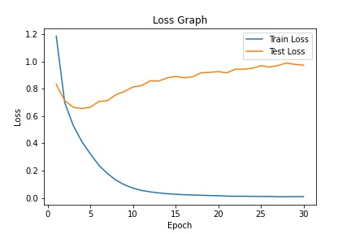
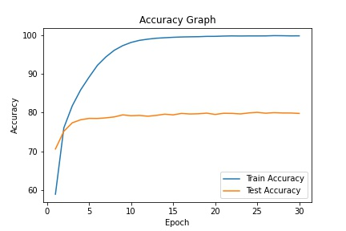

<h1 align='center'>Training Summary</h1>

## Data
|    | Description          | value                                                                |
|---:|:---------------------|:---------------------------------------------------------------------|
|  0 | Total Train Data Set | 50000                                                                |
|  1 | Total Test Data Set  | 10000                                                                |
|  2 | Total Classes        | 10                                                                   |
|  3 | Class Names          | airplane, automobile, bird, cat, deer, dog, frog, horse, ship, truck |
## Model
|    | Description   | value                                                                |
|---:|:--------------|:---------------------------------------------------------------------|
|  0 | Model         | Resnet 18(Pretrained)                                                |
|  1 | Optimiser     | SGD (lr=0.001, momentum=0.9)                                         |
|  2 | Loss function | Cross Entropy                                                        |
|  3 | Total Epoch Trained | 30 |
## Training
|    |   epoch |   train_accuracy |   train_loss |   test_accuracy |   test_loss |   airplane |   automobile |   bird |   cat |   deer |   dog |   frog |   horse |   ship |   truck |
|---:|--------:|-----------------:|-------------:|----------------:|------------:|-----------:|-------------:|-------:|------:|-------:|------:|-------:|--------:|-------:|--------:|
|  0 |       1 |           58.946 |   1.18542    |           70.61 |    0.831707 |       76.4 |         86.1 |   63.5 |  58.4 |   62.4 |  54   |   81.8 |    72.6 |   80.4 |    70.5 |
|  1 |       2 |           76.074 |   0.697103   |           75.19 |    0.712427 |       75.3 |         83   |   66.6 |  60.5 |   72   |  61.9 |   84.3 |    79.7 |   86.6 |    82   |
|  2 |       3 |           81.748 |   0.529711   |           77.37 |    0.663892 |       81.6 |         81.9 |   69   |  57.9 |   70.9 |  71   |   86.2 |    84.3 |   85.5 |    85.4 |
|  3 |       4 |           85.874 |   0.41269    |           78.16 |    0.654548 |       82.4 |         88.1 |   71.1 |  59.4 |   78.6 |  70.5 |   81.2 |    79.8 |   86.1 |    84.4 |
|  4 |       5 |           89.16  |   0.322332   |           78.51 |    0.664346 |       78.6 |         87.5 |   72.2 |  61.6 |   78.6 |  68.1 |   84.8 |    81.4 |   88.8 |    83.5 |
|  5 |       6 |           92.224 |   0.239228   |           78.49 |    0.706572 |       79   |         88   |   71.6 |  62.6 |   77.7 |  66.9 |   85.2 |    83.5 |   88.5 |    81.9 |
|  6 |       7 |           94.382 |   0.178655   |           78.65 |    0.712487 |       82.8 |         86.7 |   71.9 |  62.5 |   73.1 |  66.5 |   87.8 |    82.7 |   87.3 |    85.2 |
|  7 |       8 |           96.098 |   0.130474   |           78.9  |    0.756196 |       82.4 |         87   |   74   |  62.4 |   75   |  70.4 |   86   |    80.3 |   87.5 |    84   |
|  8 |       9 |           97.286 |   0.0956945  |           79.42 |    0.780501 |       81.7 |         87.9 |   72.9 |  63.8 |   80.3 |  69   |   84.7 |    83.1 |   88.3 |    82.5 |
|  9 |      10 |           98.12  |   0.0714605  |           79.2  |    0.812748 |       82.1 |         86.2 |   74.7 |  62.2 |   75.3 |  68.9 |   86.3 |    81.7 |   88   |    86.6 |
| 10 |      11 |           98.658 |   0.054754   |           79.28 |    0.822587 |       85.7 |         88.6 |   70.3 |  59.9 |   77.3 |  70.1 |   87.3 |    83.1 |   87.2 |    83.3 |
| 11 |      12 |           98.97  |   0.0443189  |           79.08 |    0.85725  |       81.1 |         86.3 |   71.6 |  61.1 |   78.8 |  68.6 |   86.7 |    81.7 |   88.9 |    86   |
| 12 |      13 |           99.204 |   0.0368633  |           79.29 |    0.856689 |       84.1 |         86.2 |   70.2 |  61.9 |   78.7 |  70   |   85.6 |    82.9 |   88   |    85.3 |
| 13 |      14 |           99.33  |   0.0303116  |           79.6  |    0.878908 |       80.5 |         89.5 |   70.5 |  61.4 |   79.2 |  70.9 |   86.4 |    83.6 |   88.7 |    85.3 |
| 14 |      15 |           99.446 |   0.0270411  |           79.42 |    0.889999 |       83.6 |         87.5 |   72.8 |  61.5 |   77.4 |  69.3 |   87.8 |    81.1 |   89.3 |    83.9 |
| 15 |      16 |           99.528 |   0.0231311  |           79.8  |    0.880344 |       83.8 |         87.1 |   71.4 |  62.7 |   80.1 |  71.3 |   83.6 |    84.5 |   88.8 |    84.7 |
| 16 |      17 |           99.572 |   0.0214709  |           79.65 |    0.887818 |       83   |         90   |   70.5 |  61.3 |   76.7 |  73   |   86.6 |    83   |   87.8 |    84.6 |
| 17 |      18 |           99.604 |   0.0194875  |           79.71 |    0.916583 |       84.1 |         86.6 |   69.8 |  61.4 |   75.9 |  69.8 |   88.6 |    85.5 |   88.7 |    86.7 |
| 18 |      19 |           99.686 |   0.0171811  |           79.87 |    0.919742 |       82.5 |         88.1 |   72.5 |  63.3 |   80.6 |  68.9 |   86.8 |    83.3 |   89   |    83.7 |
| 19 |      20 |           99.692 |   0.0163246  |           79.53 |    0.925662 |       85.1 |         87.1 |   72.3 |  64   |   76.5 |  70.5 |   85.1 |    82.4 |   87.6 |    84.7 |
| 20 |      21 |           99.764 |   0.0130538  |           79.84 |    0.916419 |       82.3 |         88.4 |   73.2 |  63   |   79.9 |  69.2 |   85.3 |    83.7 |   88.4 |    85   |
| 21 |      22 |           99.804 |   0.0118529  |           79.81 |    0.943098 |       83.9 |         88   |   73   |  63.5 |   78.4 |  69.7 |   86.7 |    81.6 |   89.2 |    84.1 |
| 22 |      23 |           99.78  |   0.0120465  |           79.67 |    0.943208 |       82   |         86.8 |   74.4 |  61.8 |   75.8 |  71.9 |   87   |    81.9 |   88.5 |    86.6 |
| 23 |      24 |           99.8   |   0.0112105  |           79.92 |    0.949438 |       84.1 |         87.4 |   73.1 |  61   |   77.6 |  69.4 |   87.2 |    83.7 |   89.6 |    86.1 |
| 24 |      25 |           99.798 |   0.0110169  |           80.07 |    0.969033 |       83.1 |         87.1 |   72.4 |  64.1 |   78.6 |  68.7 |   85.9 |    83.6 |   90.1 |    87.1 |
| 25 |      26 |           99.806 |   0.0104946  |           79.85 |    0.958854 |       83.6 |         87.5 |   72.6 |  61.8 |   77.8 |  71   |   86.2 |    82.7 |   90.1 |    85.2 |
| 26 |      27 |           99.872 |   0.00861789 |           79.99 |    0.969764 |       84.6 |         86.3 |   72.6 |  64.4 |   76.5 |  69.5 |   85.8 |    83.1 |   89   |    88.1 |
| 27 |      28 |           99.852 |   0.00859893 |           79.91 |    0.988408 |       84   |         87.7 |   72.9 |  63.1 |   78.5 |  70.7 |   86.2 |    83.8 |   87.5 |    84.7 |
| 28 |      29 |           99.81  |   0.00975261 |           79.9  |    0.977799 |       82.6 |         89.1 |   71.2 |  61.5 |   75.7 |  72.6 |   88.3 |    83.7 |   88   |    86.3 |
| 29 |      30 |           99.824 |   0.00967463 |           79.8  |    0.972805 |       84.9 |         87.2 |   71.1 |  61.8 |   74.9 |  72.5 |   85.3 |    84.5 |   89.1 |    86.7 |
## Graphs

